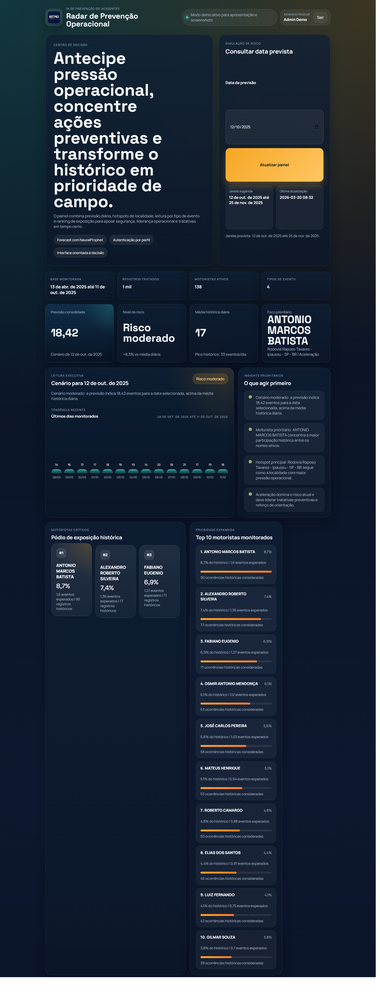
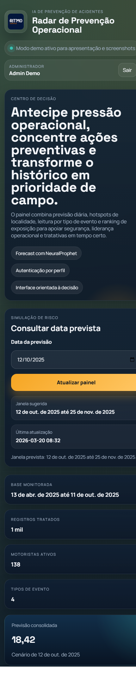

# Radar de Prevenção Operacional

Painel preditivo para prevenção de acidentes em operações logísticas, com API Flask modular, autenticação por perfil, frontend executivo e esteira CI para lint, smoke test e deploy.

## Preview

### Dashboard desktop



### Dashboard mobile



## O que mudou nesta evolução

- separação de camadas em módulos dedicados de configuração, autenticação, modelos, repositórios, serviços e rotas
- autenticação por token com perfis `admin`, `gestor` e `analista`
- endpoint administrativo protegido para diretório de usuários
- frontend com login, sessão persistida, modo demo e painel administrativo por role
- screenshots reais do dashboard publicadas no repositório
- pipeline GitHub Actions para lint, smoke test e deploy por hook

## Arquitetura

```text
.
|-- app_previsao.py
|-- radar_preventivo/
|   |-- config.py
|   |-- auth/
|   |-- models/
|   |-- repositories/
|   |-- routes/
|   `-- services/
|-- index.html
|-- style.css
|-- script.js
|-- auth_users.example.json
|-- requirements.txt
|-- requirements-dev.txt
|-- requirements-ci.txt
|-- docs/screenshots/
|-- scripts/capture_dashboard.ps1
`-- tests/
```

## Perfis de acesso

- `admin`: consulta o dashboard e acessa o diretório de usuários e permissões
- `gestor`: acessa previsões, hotspots e leitura executiva
- `analista`: acessa previsões, rankings e detalhamento técnico

Os endpoints protegidos exigem token Bearer:

- `GET /auth/me`
- `GET /auth/users` (`admin` apenas)
- `GET /predict?date=YYYY-MM-DD`

## Autenticação

### Usuários

O backend procura usuários em `auth_users.json`. O arquivo de exemplo versionado é `auth_users.example.json`.

Fluxo recomendado:

1. copiar `auth_users.example.json` para `auth_users.json`
2. trocar os hashes e usuários pelos dados reais do ambiente
3. manter `auth_users.json` fora do Git

### Login

`POST /auth/login`

Exemplo:

```json
{
  "email": "admin@radar.local",
  "password": "Admin123!"
}
```

Resposta:

```json
{
  "access_token": "token-assinado",
  "token_type": "Bearer",
  "expires_in": 28800,
  "user": {
    "name": "Admin Demo",
    "role": "admin",
    "role_title": "Administrador",
    "permissions": ["dashboard:view", "users:read", "auth:manage"]
  }
}
```

## Como rodar localmente

### Backend

```bash
python -m venv .venv
source .venv/bin/activate
pip install -r requirements-dev.txt
python app_previsao.py
```

No PowerShell:

```powershell
python -m venv .venv
.venv\Scripts\Activate.ps1
pip install -r requirements-dev.txt
python .\app_previsao.py
```

### Frontend

Abra `index.html` no navegador.

Com backend local:

- o frontend usa `http://127.0.0.1:5000` em `localhost`
- em `file://`, ele usa o fallback configurado em `FALLBACK_BACKEND_URL`
- você pode sobrescrever a API com `?api=https://sua-api`

Modo demo para apresentação e screenshots:

```text
index.html?demo=1
index.html?demo=1&demoRole=admin
```

## Deploy no Railway

O repositório agora inclui:

- `Dockerfile`
- `.dockerignore`
- `railway.json`

Isso faz o Railway usar build por Dockerfile em vez de depender da detecção automática do Railpack.

### Variáveis recomendadas no Railway

- `APP_SECRET_KEY`: chave de assinatura dos tokens
- `APP_ALLOW_DEMO_USERS=true`: útil para validar a API rapidamente
- `APP_PREDICTOR_MODE=neuralprophet`: modo real

Se você ainda não tiver um `auth_users.json` real no deploy, use `APP_ALLOW_DEMO_USERS=true` temporariamente para testar login com:

- `admin@radar.local` / `Admin123!`
- `gestor@radar.local` / `Gestor123!`
- `analista@radar.local` / `Analista123!`

Depois, substitua por usuários reais via `APP_AUTH_USERS_FILE` ou imagem customizada com o arquivo apropriado.

## Geração de screenshots

Script incluído:

```powershell
.\scripts\capture_dashboard.ps1
```

O script usa Chrome headless para gerar:

- `docs/screenshots/dashboard-overview.png`
- `docs/screenshots/dashboard-mobile.png`

## Testes e pipeline

### Lint local

```bash
ruff check .
```

### Smoke test local

```bash
pytest
```

Os testes usam `predictor_mode=mock`, evitando depender de treinamento real do NeuralProphet no CI.

### GitHub Actions

Workflow em `.github/workflows/ci.yml`:

- instala dependências leves de CI
- roda `ruff check .`
- roda `pytest`
- dispara deploy via hooks do Render em `main`

Secrets esperados para deploy:

- `RENDER_BACKEND_DEPLOY_HOOK_URL`
- `RENDER_FRONTEND_DEPLOY_HOOK_URL`

## Configurações úteis

- `APP_DATA_FILE`: caminho do CSV principal
- `APP_DISMISSED_DRIVERS_FILE`: caminho do CSV de motoristas desligados
- `APP_AUTH_USERS_FILE`: caminho do arquivo real de usuários
- `APP_ALLOW_DEMO_USERS`: habilita usuários demo no backend
- `APP_PREDICTOR_MODE`: `neuralprophet` ou `mock`
- `APP_SECRET_KEY`: chave de assinatura dos tokens
- `APP_TOKEN_TTL_SECONDS`: validade do token
- `FORECAST_DAYS`: horizonte da previsão
- `RECENT_HISTORY_DAYS`: janela da série recente

## Observações de deploy

- o fluxo de deploy do workflow usa hooks para desacoplar CI de provedor
- o frontend continua estático e pode ser hospedado em Render, Netlify, Vercel ou GitHub Pages
- o backend suporta mock mode para smoke tests e NeuralProphet para ambiente real

## Crédito

Projeto de Renato Boranga, evoluído para uma base mais profissional com foco em produto, governança de acesso, apresentação visual e operação contínua.
